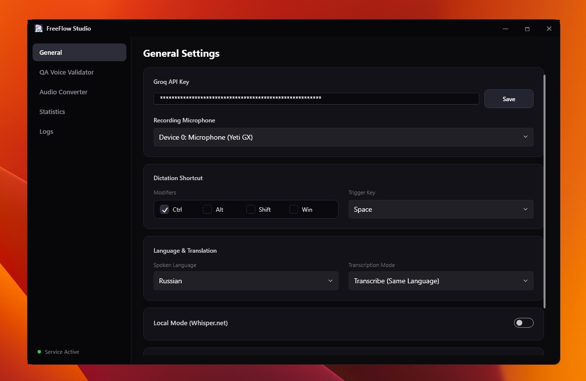

# FreeFlow Studio 🚀

> **Next-Gen AI Voice Dictation, Voiceover QA Validator & Acoustic Prosody Analyzer for Windows.**


[](LICENSE)
[](https://dotnet.microsoft.com/)
[](https://github.com/lepoco/wpfui)
[](https://groq.com/)
[](https://microsoft.com)

**FreeFlow Studio** is a high-performance Windows desktop suite engineered for video creators, crypto marketers, podcasters, and AI voice producers. It combines ultra-fast global voice dictation with automated **STT voiceover validation**, **acoustic human-likeness scoring (Prosody Analysis)**, and **batch audio conversion**.

---

## 🌟 Key Features

### 🎙️ 1. Global AI Voice Dictation
- **System-Wide Hotkey Activation**: Trigger dictation instantly from any app using hardware-level keyboard hooks (`GetAsyncKeyState`).
- **Groq Whisper STT Speed**: Powered by `whisper-large-v3-turbo` for near-instant speech recognition with custom domain vocabulary prompts (Crypto, Web3, Subtitles).
- **Auto-Paste**: Direct text injection into active fields, IDEs, text editors, or web browsers.

### 🎯 2. QA Voiceover & STT Script Validator
- **Batch Drag & Drop**: Drop dozens of audio files (`.mp3`, `.wav`, `.m4a`, `.flac`) simultaneously for bulk QA testing.
- **Word-by-Word Diff Matrix**: Visual color-coded token badges displaying exact text matches, mispronunciations, prompter deletions, and extra insertions.
- **Per-File Report Cards**: Dedicated breakdown cards for every audio take to easily compare performance.


---

### 🧠 3. Acoustic Prosody & AI Naturalness Detector
- **Human-Likeness Score (`NATURALNESS %`)**: Calculates RMS energy variance, micro-pause frequency, and pitch dynamics to distinguish organic human recordings from robotic AI audio.
- **Audience Protection**: Flags robotic monotonic voiceovers before publishing to Tier-1 traffic channels.
- **Actionable AI Feedback**: Recommends exact adjustment parameters for ElevenLabs voice generation.

---

### 🎚️ 4. ElevenLabs Voice Optimization & Syntax Hacks
- **Preset Cheat Sheet**: Recommended stability (35–45%), similarity (75–85%), and style exaggeration settings for realistic institutional voiceovers.
- **One-Click Humanizer**: Automatically injects breath dashes (`—`), pauses (`...`), and organic filler starters (`Look,`, `Well,`) into target scripts.

---

### ⚡ 5. Batch Media & Audio Converter
- **Multi-File Processing**: Convert audio and video files (`.mp3`, `.wav`, `.m4a`, `.flac`, `.mp4`, `.mov`, `.avi`) in parallel.
- **Audio Extraction**: Rip high-fidelity audio streams directly from video footage.
- **Custom DSP Parameters**: Adjustable sample rates (44.1kHz, 48kHz), bitrates (up to 320 kbps), and mono/stereo channels.


---

### 📊 6. Telemetry & Productivity Tracking
- Tracks daily, weekly, and monthly dictated word counts.
- Displays voice-to-typing speedup factor (e.g. `3.8x faster`) and total hours saved.



---

## 💻 7. Offline Local Whisper AI (Zero VPN / Zero API)

FreeFlow Studio features a **100% standalone offline transcription engine** powered by `Whisper.net` and `ggml` C++ runtime. 

### Why Use Local Mode?
* 🔒 **Complete Privacy**: Audio never leaves your computer.
* 🌐 **Bypass VPN / Network Blocks**: Zero dependence on cloud APIs or Cloudflare WAF restrictions.
* 💸 **Unlimited & Free**: No API quotas, usage limits, or subscription costs.

### Available GGML Models

| Model | File Size | VRAM / RAM | Speed | Accuracy | Best For |
| :--- | :--- | :--- | :--- | :--- | :--- |
| **`ggml-base.bin`** | ~140 MB | ~500 MB | ⚡⚡⚡ Instant | Good | Quick dictation & low-spec laptops |
| **`ggml-small.bin`** *(Default)* | ~460 MB | ~1.0 GB | ⚡⚡ Very Fast | High | Balanced daily dictation (Russian & English) |
| **`ggml-large-v3-turbo.bin`** | ~1.5 GB | ~3.0 GB | ⚡ Fast | 🎯 Maximum | Technical terms, accents, & complex scripts |

### How to Enable Local Mode
1. Launch **FreeFlow Studio** and navigate to the **General** tab.
2. Under **Local Mode (Whisper.net)**, toggle the switch to **ON**.
3. Select your desired model (`ggml-small.bin` recommended).
4. The application will automatically download the GGML model directly to `%AppData%\FreeFlowWindows\Models\` on first use and initialize the offline engine.

---

## 🏗️ Architecture & Technology Stack

- **Framework**: C# / .NET 8 WPF
- **Design System**: WPF.Ui (Fluent Dark Mode theme with native Windows 11 glassmorphism)
- **STT Engine**: Groq Cloud REST API (`whisper-large-v3-turbo`)
- **Audio DSP**: NAudio & MediaFoundation API
- **System Hooks**: Windows P/Invoke (`SetWindowsHookEx`, `GetAsyncKeyState`)

```
FreeFlowWin.slnx
 ├── FreeFlowWin.App    (WPF Client Application, XAML views & UI controllers)
 ├── FreeFlowWin.Core   (STT API client, Prosody Analyzer, Audio Engine, Settings)
 └── FreeFlowWin.TestApp(Automated test harness for core audio & QA modules)
```

---

## 🛠️ Build & Installation Guide

### Prerequisites
- **Operating System**: Windows 10 (1903+) or Windows 11
- **Runtime**: [.NET 8.0 SDK](https://dotnet.microsoft.com/download/dotnet/8.0)

### Building from Source

```bash
# Clone the repository
git clone https://github.com/bbimer/WisperFree.git
cd WisperFree

# Restore and build the solution
dotnet build FreeFlowWin.slnx -c Release

# Publish self-contained executable
dotnet publish FreeFlowWin.App/FreeFlowWin.App.csproj -c Release -r win-x64 --self-contained false -o ./publish
```

---

## 📜 License

This project is licensed under the MIT License - see the [LICENSE](LICENSE) file for details.
