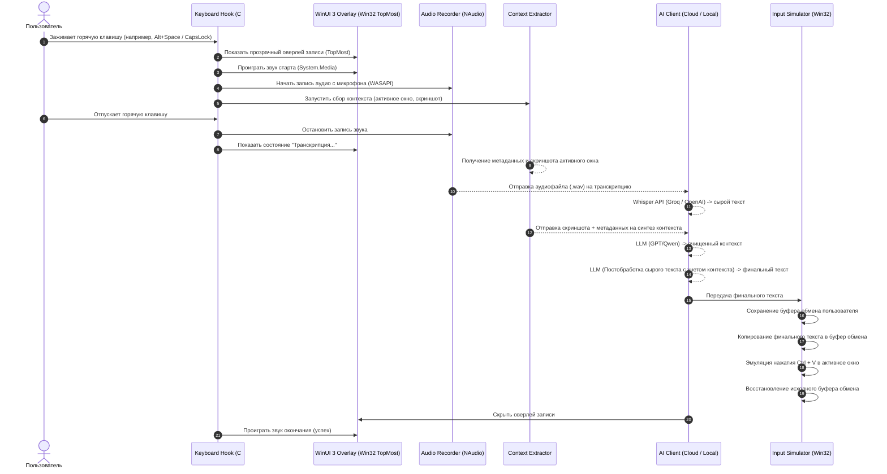
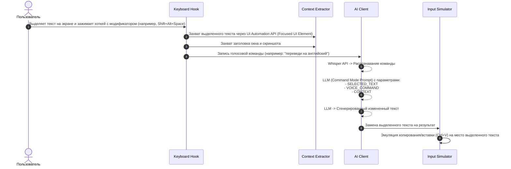

# Архитектура проекта FreeFlow Windows (Wispr Flow Clone)

Документ описывает архитектуру нативного приложения голосового ввода с контекстной очисткой текста для операционной системы Windows на базе платформы **.NET 8/9 (C#)** и **WinUI 3**.

---

## 1. Обзор системы и рабочие процессы (Workflows)

Приложение работает в фоновом режиме (в системном трее) и активируется по глобальной горячей клавише. Поддерживаются два основных режима работы: **Режим диктовки (Dictation Mode)** и **Режим редактирования (Edit Mode)**.

### 1.1. Режим диктовки (Dictation Mode)



### 1.2. Режим редактирования (Edit Mode / Command Mode)

Используется для трансформации выделенного текста с помощью голосовых команд (например, *"сделай это профессиональнее"*, *"исправь ошибки"*, *"переведи на английский"*).



---

## 2. Диаграмма модулей (Компоненты приложения)

Приложение разделено на независимые сервисы, координируемые общим менеджером состояния (`StateManager`).

```mermaid
graph TD
    subgraph UI Layer (WinUI 3 / WPF Interop)
        MainWindow[MainWindow - Настройки]
        TrayIcon[TrayIcon - Системный трей]
        RecordingOverlay[RecordingOverlay - Прозрачный оверлей поверх всех окон]
        SoundPlayer[SoundPlayer - Системные звуки]
    end

    subgraph Core Engine (C# / .NET)
        StateManager[StateManager - Менеджер состояний]
        HotkeyManager[HotkeyManager - Перехватчик клавиш]
        AudioEngine[AudioEngine - Запись звука NAudio]
        ContextExtractor[ContextExtractor - Сбор метаданных и скриншотов]
        InputSimulator[InputSimulator - Эмуляция ввода Win32]
        ConfigManager[ConfigManager - Настройки и реестр]
        StorageManager[StorageManager - Безопасное хранение DPAPI / LiteDB]
    end

    subgraph AI Client Layer
        HttpClient[HttpClient - Облачный транспорт]
        CloudAPI[Cloud AI client - Groq / OpenAI / Ollama API]
        LocalEngine[Local Engine - Whisper.cpp DLL / C# Wrapper]
        FallbackManager[FallbackManager - Переключатель отказоустойчивости]
    end

    %% Взаимосвязи
    MainWindow --> ConfigManager
    TrayIcon --> MainWindow
    
    StateManager --> HotkeyManager
    StateManager --> AudioEngine
    StateManager --> ContextExtractor
    StateManager --> InputSimulator
    StateManager --> CloudAPI
    StateManager --> LocalEngine
    StateManager --> FallbackManager
    StateManager --> StorageManager
    
    StateManager --> RecordingOverlay
    StateManager --> SoundPlayer
    
    CloudAPI --> HttpClient
```

---

## 3. Детализация модулей

### 3.1. HotkeyManager (Глобальные хоткеи)
*   **Технология:** Win32 API функции `SetWindowsHookEx` (WH_KEYBOARD_LL) для низкоуровневого перехвата клавиатуры.
*   **Windows-специфика:** На Windows клавиша `Fn` обрабатывается на уровне контроллера клавиатуры и **не доходит до операционной системы**. В качестве альтернативы по умолчанию используются хоткеи:
    *   *Hold to talk:* `Caps Lock` или `Alt + Space`.
    *   *Toggle dictation:* `Ctrl + Alt + Space`.
    *   *Edit Mode (Manual Command):* `Shift + Alt + Space` (при выделенном тексте).

### 3.2. AudioEngine (Запись звука)
*   **Технология:** Библиотека **NAudio** с использованием **WASAPI Capture**.
*   **Задача:** Запись с устройства по умолчанию (выбранного в настройках) в формате PCM WAV (16-bit, 16kHz, моно).
*   **Оптимизация:** Аудиоданные удерживаются в оперативной памяти (`MemoryStream`), чтобы не нагружать жесткий диск постоянным созданием/удалением временных файлов.

### 3.3. ContextExtractor (Контекст активного окна)
*   **Задача:** Собрать как можно больше информации об окружении текстового фокуса.
*   **Технологии:**
    1.  **Активное окно:** `GetForegroundWindow`, `GetWindowText` и `GetWindowThreadProcessId` (для определения названия EXE-файла).
    2.  **Выделенный текст:** Windows UI Automation API (`AutomationElement.RootElement.FocusedElement`). Если элемент поддерживает `TextPattern`, считывается выделенный текст. В случае сбоя UI Automation приложение отправляет виртуальные нажатия `Ctrl + C`, сохраняя и восстанавливая исходный буфер.
    3.  **Скриншот:** Использование **Windows.Graphics.Capture API** (введено в Windows 10, работает аппаратно через DirectX). Снимок обрезается, ужимаясь до максимального размера в 1024px по большей стороне, конвертируется в JPEG с коэффициентом сжатия 0.5 для экономии лимитов токенов vision-модели.

### 3.4. InputSimulator (Симуляция ввода)
*   **Технология:** Win32 API функция `SendInput` и буфер обмена Windows.
*   **Алгоритм безопасной вставки с предотвращением race conditions:**
    1.  **Сохранение:** Чтение текущего состояния буфера обмена (включая файлы, метаданные и форматированный текст) с использованием безопасных Win32 API (`OpenClipboard`, `GetClipboardData`).
    2.  **Вставка:** Запись распознанного текста в буфер обмена и отправка последовательности `SendInput` для `Ctrl + V`.
    3.  **Задержка:** Асинхронное ожидание (конфигурируемое, 50-100 мс) для завершения обработки целевым приложением.
    4.  **Восстановление:** Восстановление исходного буфера обмена пользователя.

### 3.5. StorageManager (Безопасное хранение данных)
*   **Настройки:** Хранятся в формате JSON в папке `%AppData%/FreeFlowWindows/settings.json`.
*   **API-ключи:** Запрещено хранить в виде простого текста. Используется **Data Protection API (DPAPI)** через метод `ProtectedData.Protect` для шифрования ключей на уровне текущей учетной записи пользователя Windows.
*   **История пайплайнов (Run Log):** Легковесная база данных **LiteDB** (или SQLite) в каталоге приложения.

---

## 4. Конкурентность и потоковая модель (Concurrency)

Для предотвращения блокировок интерфейса используется строго асинхронный пайплайн на основе `Task`:

```text
[UI Thread (DispatcherQueue)]
   ├── Отрисовка оверлея, анимации звуковой волны
   └── Старт/Стоп по событиям от HotkeyManager (потокобезопасно через DispatcherQueue.TryEnqueue)

[Background ThreadPool (TaskScheduler.Default)]
   ├── WASAPI аудио-коллбэки (сбор байтов микрофона)
   ├── Захват скриншота экрана (Windows.Graphics.Capture)
   └── HTTP / WebSocket запросы к OpenAI/Groq API (async/await)
```

---

## 5. Стратегия отказоустойчивости (Fault Tolerance)

1.  **Цепочка фолбэков моделей (Circuit Breaker):**
    Приложение отслеживает ошибки API (особенно HTTP 429 - Rate Limit). Если основная модель недоступна, `FallbackManager` мгновенно перенаправляет запрос на настроенную резервную модель (например, с Groq на OpenAI или локальный Ollama).
2.  **Suspected Instruction Guard (Защита от выполнения инструкций):**
    Если постобработанный текст подозрительно короткий или представляет собой ответ чат-бота (например, *"Конечно, вот письмо:..."*), а не очищенную диктовку, детектор инструкций отменяет вставку результата и вставляет сырой (raw) транскрипт от Whisper.
3.  **Асинхронные таймауты:**
    На каждый запрос накладывается жесткий таймаут (20 секунд по умолчанию). Если транскрипция или LLM зависли, процесс прерывается через `CancellationToken`, проигрывается звук ошибки, и пользователю выводится уведомление.

---

## 6. Windows-специфичные проблемы и решения

| Проблема | Причина | Решение |
| :--- | :--- | :--- |
| **Оверлеи в WinUI 3** | WinUI 3 не поддерживает полностью прозрачные окна без рамки стандартными средствами. | Использование Win32 API Interop: вызовы `SetWindowLong` для добавления стилей `WS_EX_LAYERED`, `WS_EX_TRANSPARENT` и `SetWindowPos` с флагом `HWND_TOPMOST`. |
| **Права UAC (User Account Control)** | Если целевое приложение запущено от имени Администратора, `SendInput` из обычного приложения блокируется (UIPI). | Приложение при запуске проверяет фоновое окно. При необходимости запрашивается перезапуск приложения от имени Администратора, либо выводится предупреждение. |
| **Антивирусы** | Низкоуровневые хуки клавиатуры (`SetWindowsHookEx`) и эмуляция ввода (`SendInput`) вызывают подозрение у Defender. | Подписание готового дистрибутива самоподписанным или коммерческим сертификатом кода и упаковка в MSIX-пакет. |
| **Блокировка буфера обмена** | Некоторые приложения (особенно офисные пакеты) блокируют буфер обмена во время своей работы, ломая логику вставки. | Добавление нескольких попыток (retry-цикл) при попытке записи/чтения буфера обмена с экспоненциальной задержкой. |

---

## 7. Этапы разработки (План реализации)

1.  **Этап 1: Базовый контур захвата (MVP)**
    *   Создание каркаса приложения WinUI 3 с иконкой в трее.
    *   Реализация `HotkeyManager` (перехват клавиш) и `AudioEngine` (запись звука в WAV).
    *   Результат: При зажатии кнопки пишется файл, при отпускании запись прекращается.
2.  **Этап 2: Интеграция с API**
    *   Настройка отправки аудиофайла на Groq API.
    *   Реализация `InputSimulator` (вставка текста через буфер обмена).
    *   Результат: Нажали кнопку -> надиктовали -> текст автоматически вставился в блокнот.
3.  **Этап 3: Контекстный анализ и Безопасность**
    *   Добавление `ContextExtractor` (получение заголовка окна и скриншота через Windows.Graphics.Capture).
    *   Добавление двухшагового пайплайна (LLM постобработка с промптом очистки и контекстом).
    *   Шифрование API-ключей через DPAPI.
4.  **Этап 4: Локальный движок (C++ интеграция)**
    *   Интеграция NuGet пакета `Whisper.net`.
    *   Подключение локальных моделей `.bin` (ggml-формат).
    *   Переключение в настройках между Cloud / Local режимами.
5.  **Этап 5: Полировка интерфейса**
    *   Интеграция плавных анимаций оверлея.
    *   Настройка звукового оформления (звуки начала/успеха/ошибки).
